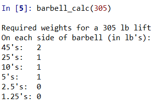

# Barbell Calculator

The barbell calculator converts weight (in pounds or kilograms) to quantities of standard exercise weights on a barbell. This calculation is a common pain point in the weightlifting community because the exercise weights only exist at specific weights. Also, the barbell itself has weight. Thus, it takes some thought for a weightlifter to determine the weights needed for a barbell lift.

Below is an example of the project's output:



This project also has a file for weightlifting in kilograms.

## To Use

To use this project copy the code from each file (barbell_calc, barbell_calc_kg) into your python file. Then, you can call the functions:

```sh
barbell_calc(weight)
barbell_calc_kg(weight)
```

## Prerequisites

Python 2.6

## Run tests on this project

```sh
barbell_calc(95)
```
Expected output:

Required weights for a 100 lb lift
On each side of barbell (in lb's):
45's:   0
25's:   1
10's:   0
5's:    0
2.5's:  1
1.25's: 0

```sh
barbell_calc_kg(100)
```
Expected output:

Required weights for a 100 kg lift
On each side of barbell (in kg's):
25's:   1
20's:   0
15's:   1
10's:   0
5's:    0
2.5's:  0
1.25's: 0
0.5's:  0
0.25's: 0

## Author

Michael O'Donnell
mro4354@gmail.com
